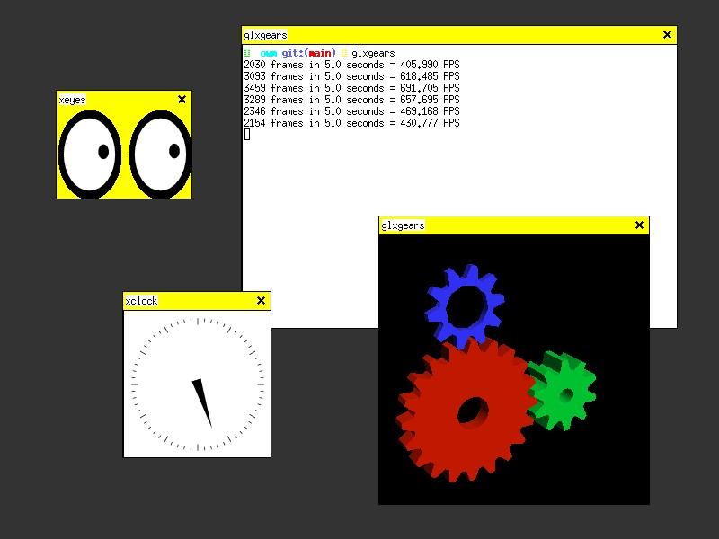

# Owm, Owl window manager 
An X11 window manager.

## Installation
Before compiling, Check the DEFAULT_FONT constant in main.rs, Make sure that
it is defined to something exists on your system.

Execute below line to install owm on your system:

- `$ sudo -E make install`

If you start X from console by typing **startx**, perform following instructions:

1. open ~/.xinitrc
2. change the last line to "exec owm"

## Tips and Tricks
* Use Alt_L, Alt_R or Meta_L + q to close the window

## Testing
The below requirements are needed for testing:
* Xephyr
* xinit
* xclock, xeyes and xterm

Execute the below line to test:
* ./test.sh

## Contributing
Please see [CONTRIBUTING.md](CONTRIBUTING.md).

## License
Please see [LICENSE](LICENSE).

## Other
A special thanks to [Ali Pakrohk](https://github.com/ALipAkrohk/) for his advises.
